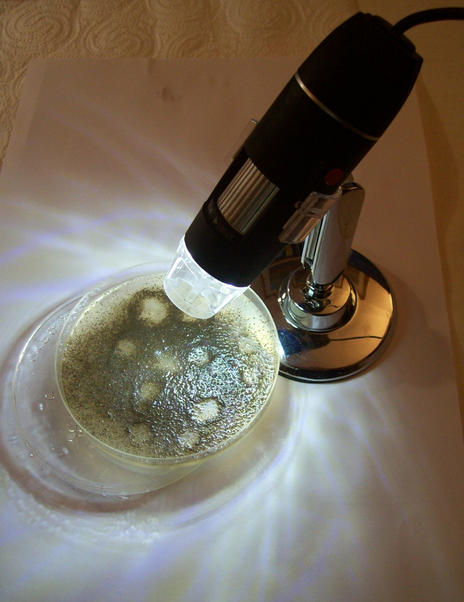

 

# 📑 Rapport d’Analyse de Sol

## Introduction

Cette analyse de sol a été réalisée en juin 2025 sur une parcelle potagère de 60 m² située dans un bocage de moyenne montagne, dans le sud-est du Massif Central (Haute-Loire, 1060 m). Le site, installé sur un substrat volcanique (basaltes, phonolites) et soumis à un climat humide d’influence cévenole, possède un sol riche en argiles gonflantes, bien structuré et régulièrement amendé avec du fumier bovin. L’objectif de cette étude est de caractériser précisément la texture, la surface spécifique, la capacité d’échange cationique (CEC) et les paramètres physico-chimiques, afin d’optimiser les pratiques culturales et de documenter un cas de référence pour les usages en IA et en modélisation agroécologique.

## Contexte

- Roche mère et substrat : granite et basalte, environnement de dômes volcaniques (phonolite et orgues basaltiques).  
- Climat : climat méditerranéen dégradé de moyenne montagne avec épisodes cévenols à l’automne, alternant périodes humides et sèches.  

À proximité immédiate de pentes volcaniques de faible altitude, dominées par la forêt de sapins (*Abies alba*), avec du hêtre (*Fagus sylvatica*) et du pin sylvestre (*Pinus sylvestris*) en lisière.  
Les sols forestiers en amont (conifères) sont acides (pH eau typique 5,5, pH KCl 4,0). Un carottage a montré un horizon éluvial E orangé à texture sableuse.  

Le sol du jardin, en prairie/bocage, a été analysé sur une parcelle de 60 m² environ, régulièrement fertilisée avec du fumier bovin. L’objectif est d’approfondir la compréhension du site et d’optimiser son usage.  

La parcelle est sur une légère pente proche de la lisière (environ 100 m) et reçoit des écoulements provenant des hauteurs voisines.

## Méthodologie d’Analyse

### Aspect général

Sol de couleur ocre (#4e3300 à #82612d), indiquant matière organique et fer oxydé, enrichi par translocation.

### Granulométrie

Les cailloux ont été séparés par tamisage ; volumes respectifs mesurés :  
- Terre fine dans récipient gradué.  
- Pierres par mesure du volume d’eau déplacé.  

Test Lamotte (ref 0760) : dispersion avec 1 mL NaOH 20%, agitation manuelle, décantation en 30 s.  
- Sables déposés rapidement.  
- Limons déposés après 30 min.  
- Argiles floculées avec CaCl₂ (1 g), repos 8–24 h.  

Résultats :  
- Sable : 16 %  
- Limon grossier : 25 %  
- Limon fin : 25 %  
- Argile : 34 %  

La terre fine représente 91 %, cailloux 9 % (>2 mm, ~5 mm).

### Discussion granulométrie

- Gonflement élevé observé : teneur réelle en argiles 35–40 %, majoritairement smectites.  
- Cassure nette au-dessus des sables : dépôt rapide de limons grossiers (apport exogène).  
- Coloration orangée (Fe³⁺) : sols bien drainés avec humidité variable. Disparition après floculation → nature colloïdale confirmée.

### Stabilité structurale

Agrégats ronds (taille cm) immergés dans eau déminéralisée : aucune désagrégation après plusieurs heures/jours.  
→ Bonne stabilité structurale, faible risque d’érosion et de battance.

### Tests physico-chimiques

- Test H₂O₂ : forte effervescence → richesse en matière organique.  
- Test acide (vinaigre 20 %) : aucun dégagement → absence de carbonates.  
- Nitrates : 250–300 ppm (élevé), pas de nitrites → bonne aération malgré nitrates élevés (risque de lixiviation vers le ruisseau proche).  
- Dureté : 250 ppm (Ca+Mg) → probable effet amendements.  

**Résultats nutriments (Kit Lamotte STH-14) :**  
- Potassium : 400–800 lb/acre (~200–400 ppm), au-dessus de l’échelle standard.  
- Phosphore : ~100 lb/acre (~50 ppm).  

**Interprétation :** Potassium très élevé, phosphore suffisant à élevé, cohérent avec apports réguliers. Pas de besoin en K, surveiller P pour éviter lessivage/excès.

### Surface spécifique des argiles

Test bleu de méthylène (AFNOR X31-107) : saturation atteinte après 12–15 mL → surface spécifique ~800–1000 m²/10 g sol → typique argiles gonflantes (smectites).

### pH (AFNOR NF X31-103)

- pH eau : 6,5  
- pH KCl : 5,8  
→ ΔpH 0,7 → acidité échangeable modérée, complexe argilo-humique saturé en bases (fumier).  

**CEC estimée :** 40–50 meq/100 g → fertilité élevée à très élevée.

## Observation microbienne

Culture sur agar enrichi → réseau filamenteux blanc après 7 j, odeur de géosmine.  
→ Présence probable d’actinomycètes (genre **Streptomyces**).

*Remarque : fragmentation de surface due à ajout d’eau, sans incidence expérimentale.*

## 🧲 Fraction magnétique

Des particules noires adhèrent à l’agitateur magnétique → magnétite (Fe₃O₄) volcanique, héritée du basalte local.  
Observation au microscope : grains alignés en chaînes, bimodalité confirmée avec ImageJ :  
- Classe 1 : ~69 µm (±18)  
- Classe 2 : ~25 µm (±5)  

→ Signature pédologique de l’héritage volcanique.  
→ Influence sur les tests granulométriques : possible sous-estimation des argiles.  

**Hypothèse spéculative :** Grains mobiles de magnétite pourraient créer des micro-anomalies magnétiques temporaires en cas de pluie, perceptibles par des espèces magnétosensibles.

## ☢️ Radioactivité de fond

- Avignon : ~10 µrem/h (substrat calcaire)  
- Site granitique : ~30–50 µrem/h (trous granitiques, radon possible)  
- Ancienne mine d’uranium : 100–120 µrem/h (gisement résiduel)  

**Instrument :** compteur Radex (bêta + gamma).  
**Note intérieure :** accumulation possible de radon dans maisons granitiques fermées.  

## 💧 Eau – contamination E. coli (sources du Meygal)

- Captages peu profonds, non chlorés, sur massif volc.-granitique.  
- Sol local grossier, peu filtrant.  
- Climat : pluies intenses → infiltration rapide.  
- Faune : cervidés/sangliers plus nombreux → fécalisation accrue.  

**Impact :** présence temporaire de **E. coli** après orages, risque gastro-intestinal léger à modéré.  
**Conseils :** faire bouillir l’eau après pluie, utiliser filtre gravitaire (ex. Berkey).  

## ⚠️ Risque aluminium

- Sols acides granitiques : relargage possible après chablis/orage violent.  
- Risque chronique négligeable, mais pics ponctuels possibles.  

## Conclusions générales

- Fertilité très élevée (CEC, matière organique, apports).  
- Risques : nitrates élevés (ruisseau), pics aluminium après perturbation forestière.  
- Hypothèse : smectites issues à la fois de l’altération basaltique et du colluvionnement forestier acide.  

**Cultures conseillées :** légumes-racines (carotte, betterave), légumineuses (haricot, pois), choux, pomme de terre. Arbres fruitiers locaux (châtaignier, pommier rustique) adaptés.  

## 📂 Structure du projet avec liens et descriptions

- 📁 [**site_location/**](site_location/)  
  - [East.jpg](site_location/East.png) — 🗺️ *Profil topographique vers l’est (graphique)*  
  - [East_real.jpg](site_location/East_real.JPG) — 🏞️ *Photo réelle de la pente exposée à l’est*  
  - [general_view.jpg](site_location/general_view.jpg) — 🌍 *Vue 3D du site (Google Earth)*  
  - [North_East.jpg](site_location/North_East.png) — 🗺️ *Profil topographique vers le nord-est (graphique)*  

- 📁 [**garden/**](garden/)  
  - [garden_1.jpg](garden/garden_1.jpg) — 🌿 *Vue générale du jardin (côté sud-ouest)*  
  - [garden_2.jpg](garden/garden_2.jpg) — 🌿 *Deuxième angle du jardin, montrant la diversité des cultures*  
  - [potatoes_garden.jpg](garden/potatoes_garden.JPG) — 🥔 *Planche de pommes de terre au stade récolte, montrant la structure du sol et la végétation bocagère*  
  - [potatoes_sharing.jpg](garden/potatoes_sharing.JPG) — 🥔 *Pesée et partage de la récolte — résultat tangible d’un sol bocager sain*  

- 📁 [**color/**](color/)  
  - [color_chart.png](color/color_chart.png) — 🎨 *Charte simplifiée des couleurs Munsell pour référence*  
  - [soil_color.jpg](color/soil_color.JPG) — 🏷️ *Photo du sol sec, couleur naturelle pour description pédologique*  

- 📁 [**H2O2_Acid_stability/**](H2O2_Acid_stability/)  
  - [organic_carbonates_test.jpg](H2O2_Acid_stability/organic_carbonates_test.JPG) — ⚗️ *Test acide (carbonates) & test H₂O₂ (matière organique oxydable)*  
  - [structural_stability.jpg](H2O2_Acid_stability/structural_stability.JPG) — 💧 *Test de stabilité structurale (agrégat intact dans l’eau)*  

- 📁 [**nitrates_hardness/**](nitrates_hardness/)  
  - [hardness_strip.jpg](nitrates_hardness/hardness_strip.JPG) — 💦 *Bandelette dureté totale (GH)*  
  - [nitrates_strip.jpg](nitrates_hardness/nitrates_strip.JPG) — 💧 *Bandelette nitrates (NO₃⁻) pour filtrat*  

- 📁 [**pH_test/**](pH_test/)  
  - [pH_test.jpg](pH_test/pH_test.JPG) — ⚙️ *Dispositif de mesure pH : bécher, barreau aimanté, agitation*  

- 📁 [**stain_test/**](stain_test/)  
  - [1_12mL.jpg](stain_test/1_12mL.jpg) — 🧪 *Test bleu de méthylène sur papier filtre (1–12 mL au total)*  
  - [13_20mL.jpg](stain_test/13_20mL.jpg) — 🧪 *Test bleu de méthylène sur papier filtre (13–20 mL au total)*  
  - [burette_stirrer.jpg](stain_test/burette_stirrer.JPG) — ⚙️ *Burette + agitateur magnétique*  
  - [magnetic_stirrer.jpg](stain_test/magnetic_stirrer.JPG) — ⚙️ *Test agitation sans burette*  
  - [drying_sample.jpg](stain_test/drying_sample.JPG) — ☀️ *Échantillon tamisé en séchage*  

- 📁 [**texture_test/**](texture_test/)  
  - [coarse_sand.jpg](texture_test/coarse_sand.JPG) — 🧱 *Tube avec fraction sable grossier et colloïdes ferriques visibles*  
  - [sieved_soil_volume.jpg](texture_test/sieved_soil_volume.JPG) — 📏 *Volume mesuré de terre fine après tamisage*  
  - [soil_stones_ratio.jpg](texture_test/soil_stones_ratio.jpg) — 📊 *Camembert : terre fine vs pierres (>2 mm)*  
  - [stones_volume_before.jpg](texture_test/stones_volume_before.JPG) — ⚖️ *Volume pierres avant immersion (mesure brute)*  
  - [stones_volume_after.jpg](texture_test/stones_volume_after.JPG) — ⚖️ *Volume pierres après immersion (volume déplacé)*  
  - [texture_graphic.jpg](texture_test/texture_graphic.jpg) — 📊 *Diagramme textural (sable, limon, argile)*  
  - [texture_test.jpg](texture_test/texture_test.JPG) — 🧪 *Séparation visuelle sable/limon/argile en tubes*  

- 📁 [**magnetites/**](magnetites/)  
  - [before_magnet_test.jpg](magnetites/before_magnet_test.JPG) — 🗂️ *Sol étalé avant application de l’aimant*  
  - [after_magnet_test.jpg](magnetites/after_magnet_test.JPG) — 🧲 *Sol après passage de l’aimant : traces magnétiques visibles*  
  - [aligned_magnetites_X40.jpg](magnetites/aligned_magnetites_X40.JPG) — 🔬 *Microscopie X40 : grains de magnétite alignés (annotés)*  
  - [aligned_magnetites_X100.jpg](magnetites/aligned_magnetites_X100.JPG) — 🔬 *Microscopie X100 : détail avec magnétite + quartz & feldspath*  
  - [class_1_magnetites_in_micron.png](magnetites/class_1_magnetites_in_micron.png) — 📏 *Stats ImageJ : **Classe 1** (gros grains)*  
  - [class_2_magnetites_in_micron.png](magnetites/class_2_magnetites_in_micron.png) — 📏 *Stats ImageJ : **Classe 2** (grains fins)*  
  - [X40.jpg](magnetites/X40.JPG) — 🎛️ *Image brute pour calibration ImageJ (40×)*  
  - [X100.jpg](magnetites/X100.JPG) — 🎛️ *Image brute pour calibration ImageJ (100×)*  
  - [spoon_test_film.mp4](magnetites/spoon_test_film.mp4) — 🍽️ *Contrôle : une cuillère ne produit pas de stries → artefact mécanique écarté*  
  - [magnet_test_film.mp4](magnetites/magnet_test_film.mp4) — 🎥 *Film : sol réagissant en temps réel à l’aimant*  
  - [turning_magnetites_film.mp4](magnetites/turning_magnetites_film.mp4) — 🎥 *Gros plan : grains tournant et s’agrégeant dynamiquement*  
  - [metadata.json](magnetites/metadata.json) — 📄 *Métadonnées descriptives des films (résolution, fps, durée, contexte)*  

- 📁 [**potash_phosphorus_test/**](potash_phosphorus_test/)  
  - [Potash_Phosphorus_test_1.JPG](potash_phosphorus_test/Potash_Phosphorus_test_1.JPG) — 🧪 *Tube potassium (orange) et tube phosphore (bleu)*  
  - [Potash_Phosphorus_test_2.JPG](potash_phosphorus_test/Potash_Phosphorus_test_2.JPG) — 🧪 *Vue alternative confirmant les mesures semi-quantitatives*  

- 📁 [**soil_microbiology/**](soil_microbiology/)  
  - [scale_900_1000_nm_circles.jpg](soil_microbiology/scale_900_1000_nm_circles.jpg) — 🎯 *Échelle de calibration : cercles 900–1000 nm*  
  - [streptomyces_1.jpg](soil_microbiology/streptomyces_1.jpg) — 🧫 *Réseau filamenteux microbien (Streptomyces suspecté)*  
  - [streptomyces_2.jpg](soil_microbiology/streptomyces_2.jpg) — 🧪 *Croissance dense dans agar*  
  - [streptomyces_3.jpg](soil_microbiology/streptomyces_3.jpg) — 🔬 *Zone périphérique à filaments dispersés*  
  - [USB_microscope.jpg](soil_microbiology/USB_microscope.jpg) — 💡 *Dispositif d’observation USB microscope*  

🔗 Projet lié :

Fait partie de l’écosystème Lyra  
- [Lyra_Leaf_SPAD_Calibration](https://github.com/Jerome-openclassroom/Lyra_Leaf_SPAD_Calibration) — Calibration capteur SPAD pour estimer chlorophylle.  
- [Lyra_LowCost_Soil_Leaf](https://github.com/Jerome-openclassroom/Lyra_LowCost_Soil_Leaf) — Modèle sol-feuille low-cost pour productivité.  
- [Leaf_Chlorose_CNN_Training](https://github.com/Jerome-openclassroom/Leaf_Chlorose_CNN_Training) — CNN classification feuilles chlorosées vs saines.  
- [TurbiditySensor_OpenScience](https://github.com/Jerome-openclassroom/TurbiditySensor_OpenScience) — Capteur de turbidité optique low-cost.  
- [AI_Assisted_Lake_Ecology](https://github.com/Jerome-openclassroom/AI_Assisted_Lake_Ecology) — Modèle NPP complet avec mesures terrain + IA.  
- [LimonTree_NPP_Model](https://github.com/Jerome-openclassroom/LimonTree_NPP_Model) — Modèle hydrique + NPP pour citronnier.  
- [Lyra_DO_Green_Mesurim](https://github.com/Jerome-openclassroom/Lyra_DO_Green_Mesurim) — Protocole low-tech MesurimPro + ImageJ.  
- [Lyra_Sentinel_MODIS_Site_HauteLoire](https://github.com/Jerome-openclassroom/Lyra_Sentinel_MODIS_Site_HauteLoire) — Données Sentinel-2 NDVI + MODIS LST, site semi-naturel.  
- [Eco_Profile_Saint_Julien_1060](https://github.com/Jerome-openclassroom/eco-profile-saint-julien-1060) — Site éco-climatologique 1 ha, données 2017–2018.  
- [Lyra_Botanical_Protocol](https://github.com/Jerome-openclassroom/lyra-botanical-protocol) — Identification botanique probabiliste par LLM.  

## 🔖 Licence
Licence MIT – science ouverte, écologie ouverte.
